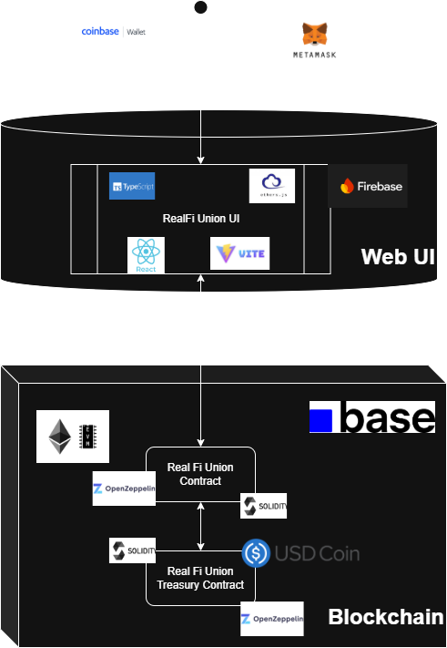

# Welcome to RealFi Union  
*The decentralized Credit Union*

## Introduction 
RealFi Union has been created to implement the RealFi use case of community finance. In short in the Global South there is a real problem with funding and securing small value short term borrowing. Even more existing solutions require numerous checks and collateral, which people often don't have. RealFi Union works to relieve this pain by creating an on chain environment of willing lender, willing borrower. 

## How it works 
RealFi Union works by enabling savers to vote for loans they wish to grant. The loans are created from requests by  borrowers who are also members of the union. The model has been designed to encourage members to lend to one another with the aim of lending more than they borrow. The idea is to create a virtuous cycle where greater lending leads to a greater borrowing capacity for a user. The different actions users can take with RealFi Union are summarised below: 
- **Join** - Members join the Union by making an on chain deposit of any amount
- **Leave** - Members can leave the Union at anytime only if they have paid back all their loans and have no lending outstanding 
- **Deposit** - Members can deposit any amount with the Union 
- **Withdraw** - Members can withdraw any amount from the Union. Members however can only withdraw their up to the maximum of their available balance i.e. they cannot withdraw any funds they've lent out 
- **Request Loan** - Members can request a Loan from the Union if they either have available funds or their balance is greater than the amount that they need 
- **Cancel Loan** - Where a loan is voted into approval members can cancel the loan before drawdown restoring funds and votes back to contributing members
- **Draw down Loan** - Members can draw down their loan at which point their balance is locked until the loan is paid
- **Repay Loan** - Members can repay a loan. Full payment closes the loan restoring funds and votes back to  contributing members
- **Vote** ( for a Loan) - Members can vote for specific Loan Requests. When a vote is cast it automatically locks funds from the voter which are used to contribute to the borrower's loan 
- **Rescind Vote** ( for a Loan) - Members can recover their funds before approval by rescinding their vote at cost to stop members backing out of commitments 

## Technical Architecture 
RealFi Union has been architected in the manner below: 

## Deployment Configuration
Below you will find the deployment configuration for the live version of RealFi Union. 
**Note: this version has not been audited for bugs and is purely for test purposes only.** 

## RealFi Union Contracts
- **Chain BASE (Mainnet)** : 8453
- **Union Token (USDC)** : [0x833589fCD6eDb6E08f4c7C32D4f71b54bdA02913](https://basescan.org/token/0x833589fcd6edb6e08f4c7c32d4f71b54bda02913)
- **RealFi Union Contract** : [0xD0Cc1d0E1F4005e09a88e0C4AD1719Fd71969C67](https://basescan.org/address/0xD0Cc1d0E1F4005e09a88e0C4AD1719Fd71969C67)
- **RealFi Union Treasury Contract** : [0x77CBEbB2F1F36ACcd8Ae3a563FA1F0B5920638b1](https://basescan.org/address/0x77cbebb2f1f36accd8ae3a563fa1f0b5920638b1)

### Contract Configuration Items 
#### RealFi Union
- `setFee` : this sets the associated fees to be charged by the Union for various services such as: 
	- **MEMBER_FEE** - membership fee required to join the Union
	- **LOAN_FEE** - fee paid for loan issue
	- **LOAN_REQUEST_FEE** - fee paid for loan request
	- **VOTE_FEE** - fee paid to vote for a particular loan request
	- **RECIND_VOTE_FEE** - fee paid to cancel a vote for a particular loan request
- `setVoteMultiple` : this sets the vote multiplier should one be desired by the union. This allows for smaller contributions across more loands
- `setVoteThreshold` : this sets the threshold of votes required to approve a given loan request
- `setRate` : this sets the interest rates that are used and can be requested from the union 

## Developer Notes 
The following guide will give you instructions on how to build
